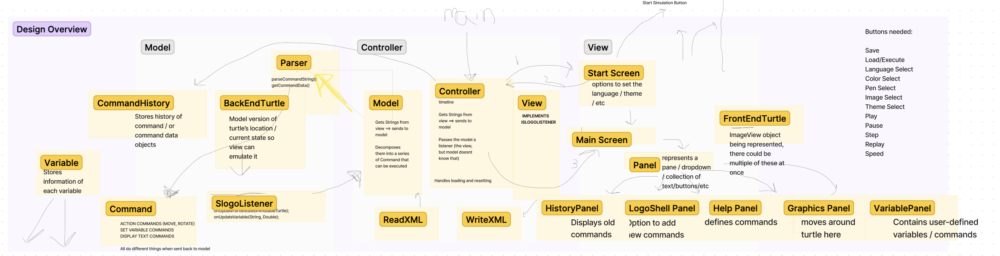

# SLogo Design Plan
### NAMES: Noah Loewy, Yash Gangavarapu, Abishek Chatuat, Bodhaansh Ravipati

### TEAM 05

## Introduction

## Configuration File Format

## Design Overview

 

Our Design is essentially broken down into the 
following 3 main components as see in the diagram above:

`Model`:
The Model will consist of first the Parser which will take user input for commands either from the 
input area in the view or from an XML file. The Parser will then parse the input and include
methods that parse the input or command string into something that the backend can understand and
work with. There should also be a method that takes in the parsed input and then executes the
CommandData object. The CommandData object will be a class that holds the parsed input and then
depending on what the input is will return a new output that can be used by the view.
For the Command Data, there will be different subclasses of the overarching Command class that will  
handle different specific use cases. There will also be a Backend Turtle class in the model that can 
be updated and represented by CommandData.

`View`:
The View will consist of the GUI which will be the main way that the user interacts with the IDE.
The GUI will include a text area where the user can input commands, a display area where the user
can see the output of commands with the turtle moving, lines being drawn, and answers to the 
queries. 

`Controller`:
The Controller will be the Main middleman that will be in charge of running the program.
It will load and initialize the starting things for user interface and parsers. Then while the
program is running it can get strings and commands from the view or xml and send it to the model.
It will also get the updated Command Data and Turtle which will then be sent to both the view 
and model again to update.

## Design Details

### View

The primary classes of the `View` package include:

`MainScreen`: This class represents the main screen of the SLogo Language application. It serves as the primary user interface where users interact with various components of the application. It is called and displayed by the Controller, and consists of a series of panels organized on a canvas/group.

`StartScreen`: The start screen is responsible for displaying the initial loading screen for the SLogo Language game. This screen provides users the options to choose their language specifications, as well as the overarching background theme of the application.

`IPanel`: This interface represents a singular collection of related widgets on a scene for the SLogo Language application. These will make up the main screen and allow for users to interact with the program directly.

`FrontEndTurtle`: keeps track of all data that is needed to display the turtle. This includes, but is not limited to, the actual ImageView object the turtle is represented by, the coordinates of the turtle, the orientation of the turtle, and the pen color of the turtle.

`LogoShellPanel`: this panel will allow users to write commands and declare variables by inputting text directly into the user interface.

`HistoryPanel`: this panel will show users their previous commands

`GraphicsPanel`: this panel will show users the current state of the turtle, as well as any drawing created by the turtle. 

`VariablePanel`: this panel will show users all user-defined variables and commands, as well as their actual values.

### Model

The primary classes of the `Model` package include:

`Parser`: The role of the parser is to take a string that represents a command, and then use it to create an actual command object (or series of command objects) that can be executed. 

`Variable`: This class stores all variables that are currently in scope for the SLogo program. This includes the name and value of the variable, so expressions including the variable can easily be evaluated

`Command`: This is the superclass for all the command classes. This abstract class / interface will only contain 1 method, an execute method which will update the backend model's state, and create a CommandData object to send to the front end. This may be later separated into two methods.

`CommandData`: This is the record that will be passed from the Model to the Controller. This will be immutable, and will allow for the Controller to see how the state of the turtle is updated following a command, without actually being able to update the BackEndTurtle itself.

`BackEndTurtle`: Like the FrontEndTurtle, this will store all the necessary data for the turtle. This includes its current location, orientation, and more. The frontend turtle will always be aligned with the back end turtle after each time step, and this will ensure the model is able to make calculations based off of the current status of the view.

`CommandHistory`: This class will store previous command objects that have been called, to allow for the reversal / replay of commands, and allow for easy extension. 

### Controller

The `Controller` class will serve as the mediator between the view and model, using EventHandlers to interact with user input from the view, and send it to the model for parsing, and then back to the view so the turtle can be updated.
## Design Considerations

Model-View Separation
* One of our major discussions throughout the design process regarded the passing of information 
from the model to the view. We knew that we wanted to implement some sort of Controller class to 
serve as a mediator, but this still did not solve the problem of passing data from one package to 
the other. One option was to pass Command objects to the view had discuss how and where we wanted to
pass information from the model and view. A big part 
we needed to consider was with the command. We went back and forth on how we should and whether we
should have the commands be executed and understood in the model and then have the view just
be updated and change the graphics or if we should parse the command in the model and then within
the view have the command be executed. We ended up doing a variation of the first option, but by 
creating a controller which would be the call the model and have it parsed and executed into a 
data object which updates the turtle in the backend. Then the controller would take that and update
it in the view.

APIs
* The biggest design consideration for this was what we wanted to include in each API. 

## Test Plan
[//]: # (Use Cases, need 4, and then 4 more per person, so 20)

### General Use Cases
1. x
2. x
3. x
4. x
### Noah's Use Cases
1. x
2. x
3. x
4. x
### Yash's Use Cases
1. x
2. x
3. x
4. x
### Abishek's Use Cases
1. x
2. x
3. x
4. x
### Bodhaansh's Use Cases
1. x
2. x
3. x
4. x

## Team Responsibilities

 * Team Member #1

 * Team Member #2

 * Team Member #3

 * Team Member #4

