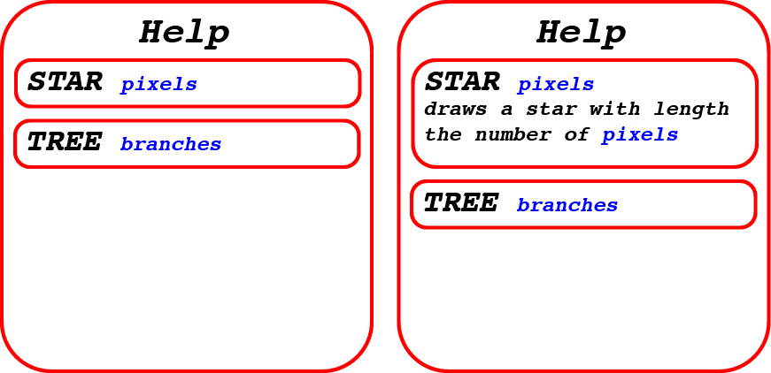

# SLogo Design Plan

### NAMES: Noah Loewy, Yash Gangavarapu, Abhishek Chataut, Bodhaansh Ravipati

### TEAM 05


- So far, our splash screen will only allow users to complete the core requirements. In the future,
  we may add different options like different logo languages if time permits.
  
- Out initial screen is again barebones, with the core requirements being met. One challenge is that
  the three side panes have to be scrollable, allowing users to see all past commands and variables.
  
- Our help screen will be a basic documentation tool. When the user clicks a command, the
  documentation will completely load if the file has it.
  
- This is the most basic turtle command. The user chose not to define this with any variables, so
  none are added to the side pane.
  
- This is a rudimentary error message, but we will likely use the JavaFX popup API to handle this.
  
- We will again use the JavaFX popup API to show this error.

## Introduction

Our biggest priorities so far are frontloading API planning and design at the beginning, so
implementation goes smoothly. In the process, we want to have a clean, self-documenting API. We want
Main to pass control to the Controller, because we want to limit the size of Main. Controller will
intermediate View and Model. Both will be highly abstracted, and View is particularly complex
because of multiple panes.

## Configuration File Format

```xml
<commands>
  <command>
    <canonicalName>forward</canonicalName>
    <description>Moves the turtle forward this many pixels.</description>
    <example>fd 50</example>
    <helpDocumentation>
      <parameters>
        <parameter name="pixels" type="double">The number of pixels to move forward.</parameter>
      </parameters>
      <returnValue type="double">The distance moved.</returnValue>
      <category>Movement</category>
    </helpDocumentation>
    <numberOfExpectedParameters>1</numberOfExpectedParameters>
    <implementingClass>slogo.model.commands.ForwardCommand</implementingClass>
  </command>
  <command>
    <canonicalName>Right</canonicalName>
    <description>Rotates the turtle clockwise by the specific degree.</description>
    <example>rt 90</example>
    <helpDocumentation>
      <parameters>
        <parameter name="degrees" type="double">The number of degrees to turn right.</parameter>
      </parameters>
      <returnValue type="double">The new direction of the turtle in degrees.</returnValue>
      <category>Rotation</category>
    </helpDocumentation>
    <numberOfExpectedParameters>1</numberOfExpectedParameters>
    <implementingClass>slogo.model.commands.RightCommand</implementingClass>
  </command>
</commands>

```

## Design Overview


Our Design is essentially broken down into the following 3 main components as see in the diagram
above:

`Model`:
The Model will consist of first the Parser which will take user input for commands either from the
input area in the view or from an XML file. The Parser will then parse the input and include methods
that parse the input or command string into something that the backend can understand and work with.
There should also be a method that takes in the parsed input and then creates all of the necessary
Command objects, and then calls the object's `execute` function. Upon execution, Command objects may
include calls to a listener, which updates the view. It's noteworthy that the model remains agnostic
of this process, as it simply accepts an arbitrary listener. The responsibility of implementing the
listener lies within the view.

`View`:
The View will consist of the GUI which will be the main way that the user interacts with the IDE.
The GUI will include a text area where the user can input commands, a display area where the user
can see the output of commands with the turtle moving, lines being drawn, and answers to the
queries.

`Controller`:
The Controller will be the Main middleman that will be in charge of running the program. It will
load and initialize the starting things for user interface and parsers. Then while the program is
running it can get strings and commands from the view or xml and send it to the model. It will also
create the view and model objects necessary, and also create event handlers for the buttons in the 
view to use.

## Design Details

### View

The primary classes of the `View` package include:

`MainScreen`: This class represents the main screen of the SLogo Language application. It serves as
the primary user interface where users interact with various components of the application. It is
called and displayed by the Controller, and consists of a series of panels organized on a
canvas/group.

`View`: Implements the `SlogoListener` and allows for commands to call certain methods in the view
while maintaining encapsulation

`StartScreen`: The start screen is responsible for displaying the initial loading screen for the
SLogo Language game. This screen provides users the options to choose their language specifications,
as well as the overarching background theme of the application.

`IPanel`: This interface represents a singular collection of related widgets on a scene for the
SLogo Language application. These will make up the main screen and allow for users to interact with
the program directly.

`FrontEndTurtle`: keeps track of all data that is needed to display the turtle. This includes, but
is not limited to, the actual ImageView object the turtle is represented by, the coordinates of the
turtle, the orientation of the turtle, and the pen color of the turtle.

`LogoShellPanel`: this panel will allow users to write commands and declare variables by inputting
text directly into the user interface.

`HistoryPanel`: this panel will show users their previous commands

`GraphicsPanel`: this panel will show users the current state of the turtle, as well as any drawing
created by the turtle.

`VariablePanel`: this panel will show users all user-defined variables and commands, as well as
their actual values.

### Model

The primary classes of the `Model` package include:

`SlogoListener`: This class will provide a way for the model to communicate changes or updates to
the view in a decoupled and flexible manner.

`Parser`: The role of the parser is to take a string that represents a command, and then use it to
create an actual command object (or series of command objects) that can be executed.

`Variable`: This class stores all variables that are currently in scope for the SLogo program. This
includes the name and value of the variable, so expressions including the variable can easily be
evaluated

`Command`: This is the superclass for all the command classes. This interface will only contain 1
method, an execute method which will update the backend model's state, and then call the proper
function of the listener.

`ImmutableTurtle`: This is a record that will be passed from the Model to the View. This will be
immutable, and will allow for front end to see how the state of the turtle is updated following a
command, without actually being able to update the BackEndTurtle itself.

`BackEndTurtle`: Like the FrontEndTurtle, this will store all the necessary data for the turtle.
This includes its current location, orientation, and more. The frontend turtle will always be
aligned with the back end turtle after each time step, and this will ensure the model is able to
make calculations based off of the current status of the view.

`CommandHistory`: This class will store previous command objects that have been called, to allow for
the reversal / replay of commands, and allow for easy extension.

### Controller

The `Controller` class will serve as the mediator between the view and model, using EventHandlers to
interact with user input from the view, and send it to the model for parsing, and then back to the
view so the turtle can be updated.

## Design Considerations

* One of our major discussions throughout the design process regarded the passing of information
  from the model to the view. We knew that we wanted to implement some sort of Controller class to
  serve as a mediator, but this still did not solve the problem of passing data from one package to
  the other. One option was for the turtle updated in the model to be directly passed to the view.
  However, this is extremely problematic because it violates the principles of Explicit
  Immutability. An alternative option we explored is passing the immutable versions of each turtle
  state, and having both a front end and back end turtle act in parallel. This is advantageous
  because it would allow for the model to pass immutable data to the view, however may lead to some
  violations of "Don't Repeat Yourself". Another alternative is passing in Command objects that
  contain lambda functions on how to adjust the View, however this would be a violation of
  Model-View-Separation. Finally, we decided on adopting the Listener/Observer design pattern. This
  design pattern would enable us to minimize coupling between model and the view, making it easier
  to extend or modify the codebase in the future. It also enables the model and view to evolve
  independently, as changes made to one component do not necessarily impact the other.


* A second major design debate that our team extensively discussed was how to handle multiple
  commands at once, or commands that occurred as a result of a nested command. One option is to
  treat them all as a single command, but we realized that this could lead to long chains of
  conditionals that would violate DESIGN-19. As an alternative, we considered using a tree-like data
  structure to handle the flow of nested or consecutive command, and try to break down each
  individual command into its most basic components: the argument and the function (kind of like the
  way you would in functional programming).

## Test Plan

* To write easily testable code, we will utilize custom exceptions and assertions to ensure that the
  program is functioning as expected instead of relying on print statements or null checks.
* We will also write smaller, more modular methods that can be tested individually, and then
  combined to form larger, more complex methods.
* Loading File Tests:
  * Loads a SLogo file with history, checks that history is loaded same
  * Loads an empty SLogo file, gets same as empty IDE
  * Tries to load not a SLogo file, gets error message
* Forward Command Tests:
  * Forward 50, checks that turtle moves 50 pixels forward
  * fd 50, checks that turtle moves 50 pixels forward
  * fd fd 50, this should throw an error
* Splash Screen:
  * Select Spanish for language, checks that all UI is now in Spanish
  * Select Dark Mode, checks that all UI is now in Dark Mode
  * Try to select language that is not supported, gets error message
* New IDE Session:
  * Checks that the command history is empty
  * Check that turtle is in the center of the screen
  * Try to run a command that is not supported, gets error message
* [//]: # (Use Cases, need 4, and then 4 more per person, so 20)

### General Use Cases

1. The user types 'fd 50' in the command window, and sees the turtle move in the display window leaving a trail, and the command is added to the environment's history.
```java
try {
  model.parse(commandString);
  view.addCommandToHistory(commandString);
}catch (InvalidCommandException e) {}
```
2. The user types '50 fd' in the command window and sees an error message that the command was not formatted correctly.
```java
try {
  model.parse(commandString);
  view.addCommandToHistory(commandString);
}catch (InvalidCommandException e) {
    showErrorMessage(e.getMessage());
}
```
3. The user sets a variable's value and sees it updated in the UI's Variable view.
```java
variables.add(new Variable(varName, varValue));
// UI has listener and will update automatically
```
4. The user sets the pen's color using the UI so subsequent lines drawn when the turtle moves use that color.
```java
colorDropDown.setOnAction(e -> {
  model.setPenColor(dropDownMenu.getValue());
});
```

### Noah's Use Cases

1. User uses an illegal command with two many arguments (PLUS 50 50 50)
```java
try {
model.parse(commandString);
} 
catch (InvalidCommandException e) {
showErrorMessage(e.getMessage()); //message would be along the lines of
                                  // "INVALID NUMBER OF ARGUMENTS RECEIVED"
}
```
2. Controller checks to see if recent command has been added to the shell (SLOGO 59 )
```java
//in controller
if(hasCommandString()) {
  String commandString = getCommandString();
  model.parse(commandString);
 }
```
3. After parsing the command MAKE CS 308 to create a variable, CS shows up on the variable screen (SLOGO 61)
```java
//in parse or a private helper method 
execute(command); //type Command
//in execute
variables.add(new Variable(varName, varValue)); 
listener.onUpdateVariable(varName, varValue);
// in view implementation of SlogoListener
variablePanel.addVariable(varName, varValue);
```

4. User clicks the “pause simulation” button (SLOGO 75)
```java
onPauseClicked(); //event handler is called
// in onPauseClicked 
animationRunning = false; //this boolean is checked every step()
```

### Yash's Use Cases
<<<<<<< Updated upstream
=======
1. x
2. x
3. x
4. x
### Abishek's Use Cases
1. x
2. x
3. x
4. x
### Bodhaansh's Use Cases
1. ChangeBackgroundColor.java
2. ChangePenColor.java
3. LightModeToDark.java
4. InvalidCommand.java
<<<<<<< Updated upstream
>>>>>>> Stashed changes

1. User can see and access a help menu to know each command
```java
helpButton.setOnAction(e -> {
  showHelp();
}
```
2. Moving the turtle forward up in view based on the command and setting new location
```java
public void forwardTurtle(double distance) {
  // For loop allows for steps to be taken
  for (pixel : distance) {
    turtle.setPosY(currentPosY + pixel);
  }
}
```
3. After pausing, the user can step through the simulation one step at a time (SLOGO 75)
```java
stepButton.setOnAction(e -> {
  turtle.step();
}
```
4. The user can change the speed for how fast the turtle is moving or line is being made (SLOGO 78)
```java
speedSlider.valueProperty().addListener((observable, oldValue, newValue) -> {
  model.setSpeed(newValue);
}
```

### Abhishek's Use Cases

1. Button to Save Program
```java
saveButton.setOnAction(e -> saveProgram(FILE_CHOOSER));
```
2. Button Load and Execute Program
```java
loadButton.setOnAction(e -> loadProgram(FILE_CHOOSER));
public void loadProgram(FileChooser fileChooser) {
  if (file != null) {
    try (BufferedReader reader = new BufferedReader(new FileReader(file))) {
      String line;
      while ((line = reader.readLine()) != null) {
        model.parse(line); //let the model handle the commands
      }
    } catch (IOException e) {
      // Handle exception
    }
  }
}
```
3. Loading Command XML for later use
```java
public static final string COMMANDS_XML = "commands.xml";
CommandData[] allCommands = loadCommands(COMMANDS_XML);
```
4. Language Selection Properties
```java
    resources = ResourceBundle.getBundle(DEFAULT_RESOURCE_PACKAGE + language);
    String forward = resources.getString("fd");
```
English
```properties
fd = Forward
bk = Backward
```
Spanish
```properties
fd = Adelante
bk = Atras
```
### Bodhaansh's Use Cases
=======

## Team Responsibilities
>>>>>>> Stashed changes

1. ChangeBackgroundColor.java
2. ChangePenColor.java
3. LightModeToDark.java
4. InvalidCommand.java

## Team Responsibilities

* Team Member #1: Noah Loewy
  * Model (Primary)
* Team Member #2: Bodhi Ravipati
  * View (Primary)
* Team Member #3: Yash
  * Controller, View (Secondary)
* Team Member #4 Abhishek
  * XML (Primary), Properties Files (Primary), Model (Secondary)

